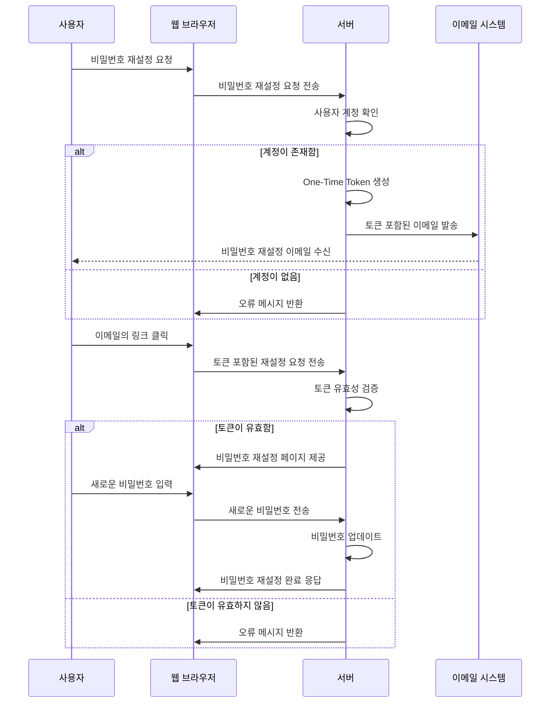
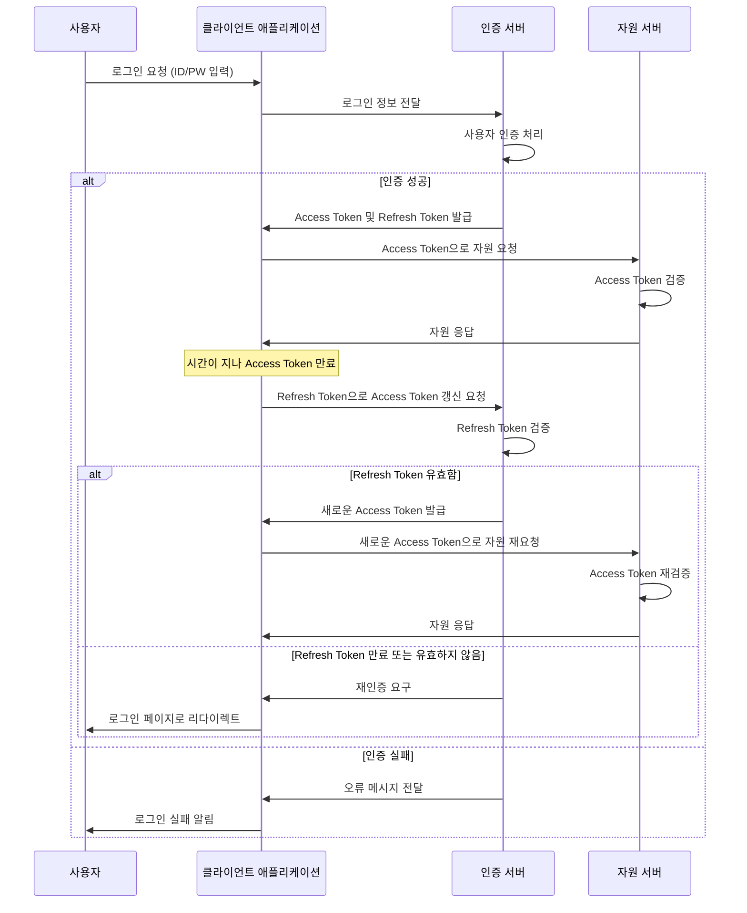

---
layout: center
headerEnable: true
headerTitle: 인증과 인가 이해하기
---

# 토큰은 크게 두 가지로 나뉜다

One-Time Token과 Persistent Token

---
layout: default
headerEnable: true
headerTitle: 인증과 인가 이해하기
---

# One-Time Token

* 한 번만 사용할 수 있는 토큰
* 주로 비밀번호 찾기, 이메일 인증 등에 사용
* 사용 후에는 폐기되어야 함
* 사용자가 토큰을 잃어버리면 다시 발급해야 함
* 보통 만료 기간이 있음
* Nonce라고 부르기도 함

---
layout: default
headerEnable: true
headerTitle: 인증과 인가 이해하기
---

# 사례 / 비밀번호 재설정

---
layout: center
headerEnable: true
headerTitle: 인증과 인가 이해하기
---

# 한 번 사용하면 반드시 폐기

---
layout: default
headerEnable: true
headerTitle: 인증과 인가 이해하기
---

# Persistent Token

* 계속 사용할 수 있는 토큰
* 주로 지속적인 로그인 상태를 유지하는 데 사용
* 사용자가 로그아웃하거나 토큰을 폐기할 때까지 유효
* 만료 기간을 두는 것이 안전

---
layout: default
headerEnable: true
headerTitle: 인증과 인가 이해하기
---

# Persistent Token을 어떻게 유지할 것인가?

* Access Token + Refresh Token
* Access Token 만으로는 만료되면 다시 로그인해야 함
* Refresh Token은 Access Token을 갱신하는 데 사용

---
layout: default
headerEnable: true
headerTitle: 인증과 인가 이해하기
---

# 사례 / 인증과 유효기간

---
layout: default
headerEnable: true
headerTitle: 인증과 인가 이해하기
---

# Access Token과 Refresh Token의 사실과 오해

* 오해: 토큰은 JWT로 만들어야 한다.
* 사실: 아니다. JWT가 유용한 경우도 있지만, 다른 방법도 존재
  * Opaque Token을 사용할 수도 있음
  * 토큰 자체에는 정보가 없고 서버 또는 데이터베이스에서 토큰을 조회해야 함

* 오해: Refresh Token은 서버에 저장되지 않는다.
*	사실: Refresh Token은 클라이언트와 서버 모두에서 안전하게 저장되어야 함

* 오해: Refresh Token은 무한히 재사용할 수 있다.
* 사실: Refresh Token도 만료 시간이 있으며, 일정 기간 후에는 갱신이 필요

---
layout: default
headerEnable: true
headerTitle: 인증과 인가 이해하기
---

# Refresh Token 연장 방법

* Refresh Token은 보통 유효 기간이 길게 설정됨
* 그래도 언젠가 만료됨

- - -

## 연장 방법
1. Refresh Token Rotation (리프레시 토큰 회전)
    * Refresh Token을 통해 연장 할 때 실행
    * 새로운 Refresh Token을 발급하면서 이전 Refresh Token을 폐기
2. Sliding Expiration (슬라이딩 만료 시간)
    * Refresh Token을 사용할 때마다 만료 시간을 연장
3. Re-authentication (재인증)
    * 일정 기간이 지나면 무조건 다시 로그인을 요구

