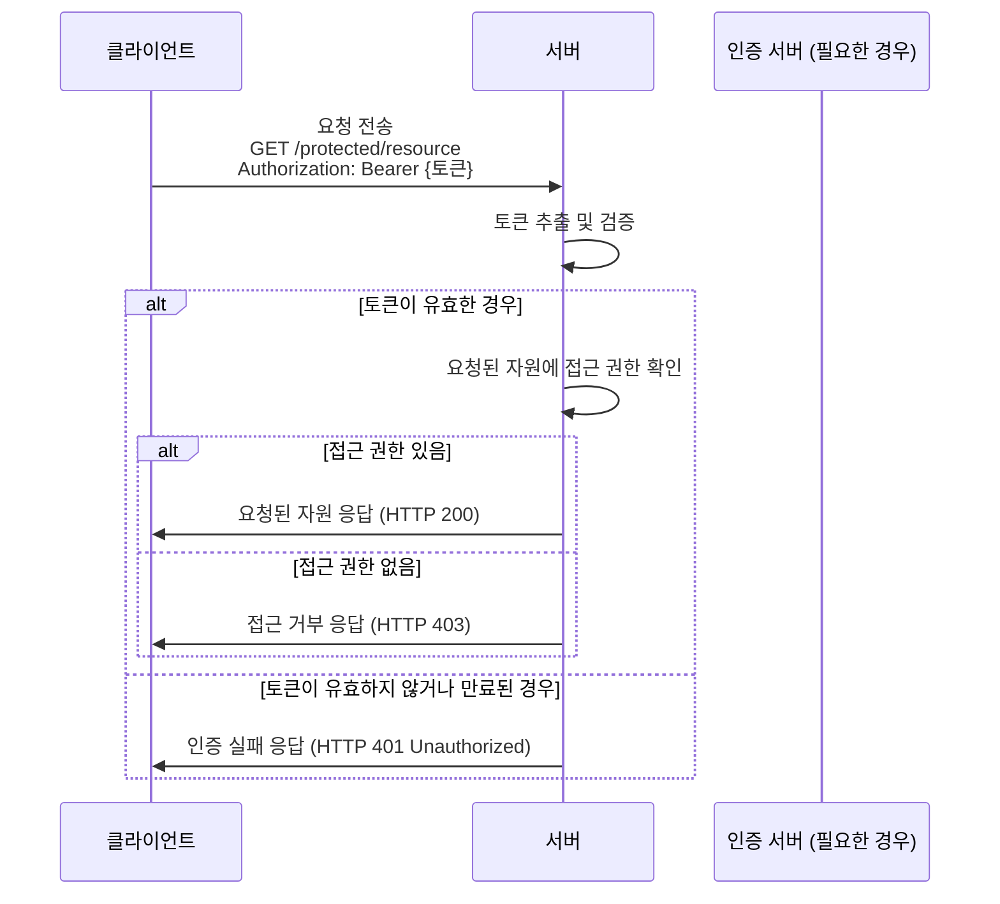
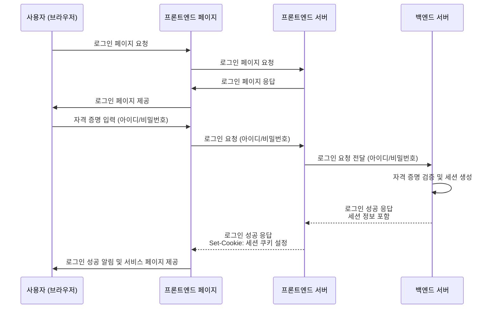
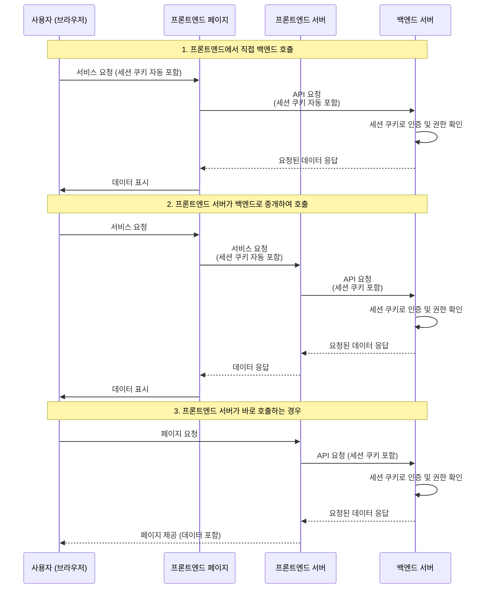
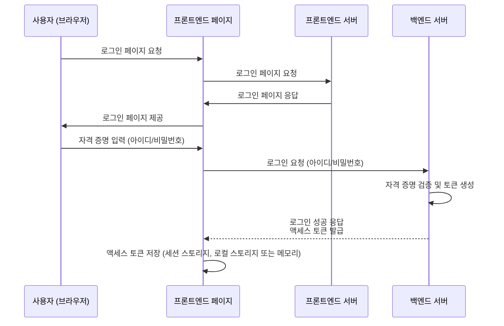
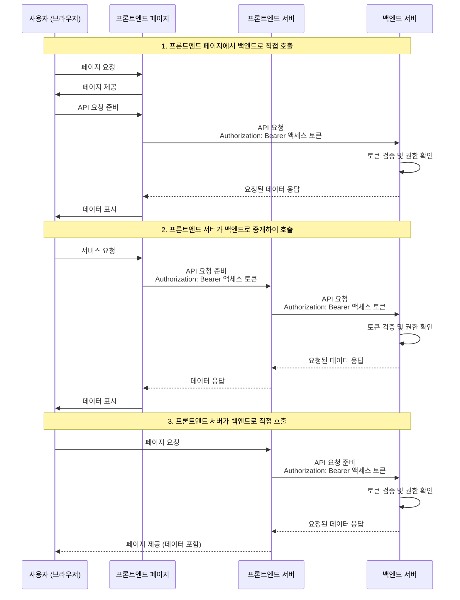

---
layout: default
headerEnable: true
headerTitle: 인증과 인가 이해하기
---

# 토큰을 교환하는 방법

* HTTP 헤더에 토큰을 포함하여 전송하는 방법
* 쿠키에 토큰을 저장하여 전송하는 방법

---
layout: default
headerEnable: true
headerTitle: 인증과 인가 이해하기
---

# 무엇이 옳은가?

* 정답은 없음 결국 트레이드 오프
* 쿠키로 전송하는 방법
  * CSRF 공격에 취약
  * 클라이언트에서 접근할 수 없음 (읽는 것도 불가능)
  * 모든 요청에 토큰이 전송됨
  * 단일 도메인에서만 사용 가능
    * 해결하려면 reverse proxy를 사용해야 함
* HTTP 헤더로 전송하는 방법
  * 토큰을 어딘가에 저장해야 함
    * Not httpOnly cookie, localStorage, sessionStorage, IndexedDB, ...
  * XSS 공격에 취약 (스크립트 실행이 가능하면 탈취 가능)
  * SPA라면 쉬운 대안이 없음

---
layout: default
headerEnable: true
headerTitle: 인증과 인가 이해하기
---

# 헤더 방식 - Bearer 토큰 인증

* Bearer: 전달자, 소지자라는 뜻
* 토큰의 내용은 JWT, Opaque Token 등 아무거나 사용해도 무방
* 보통 Authorization 헤더에 토큰을 포함하여 전송

<spacer gap="20" />

---
layout: default
headerEnable: true
headerTitle: 인증과 인가 이해하기
---

# 쿠키 방식을 통한 로그인

---
layout: default
headerEnable: true
headerTitle: 인증과 인가 이해하기
---

# 쿠키 방식을 통한 인증/인가

---
layout: default
headerEnable: true
headerTitle: 인증과 인가 이해하기
---

# 헤더 방식을 통한 로그인

---
layout: default
headerEnable: true
headerTitle: 인증과 인가 이해하기
---

# 헤더 방식을 통한 인증/인가

---
layout: default
headerEnable: true
headerTitle: 인증과 인가 이해하기
---

# 잠깐! 프론트엔드 서버에서 토큰을 어떻게 알죠?

* 프론트엔드 서버가 존재하는 Next.js, Nuxt.js, Gatsby 등의 SSR 프레임워크
* 이 경우 페이지 요청시 서버에서 데이터를 결합하여 내려주는 방식이 자주 사용됨
* 토큰을 어떻게 알 수 있을까?
  * HTTP(Stateless) 환경에서 프론트엔드 서버와 페이지가 같은 토큰을 공유하려면 Cookie가 답
    * 로그인 요청 시 프론트엔드 서버를 경유하여 백엔드 서버로 전달
    * httpOnly 쿠키의 경우 받은 응답을 통해 쿠키를 httpOnly로 저장
    * 헤더 방식의 경우에도 localStorage 대신 쿠키에 저장하여 서버로 전달
      * httpOnly는 쓰지 않음

---
layout: default
headerEnable: true
headerTitle: 인증과 인가 이해하기
---

# 백엔드 서버와 도메인이 다르다면?

* 도메인이 완전히 다르다면 까다로워짐
  * SameSite 설정을 None으로 하면 쿠키 전송 가능
    * HTTPS(Secure) 사용 필수
  * 서버에서 CORS 설정을 통해 쿠키가 전송될 수 있게 허용해야 함
  * 혹은 리버스 프록시 서버를 사용하여 쿠키를 전달
* 서브 도메인 정도 차이라면 쿠키 설정으로 해결 가능
  * 도메인 설정을 `.example.com`과 같이 설정