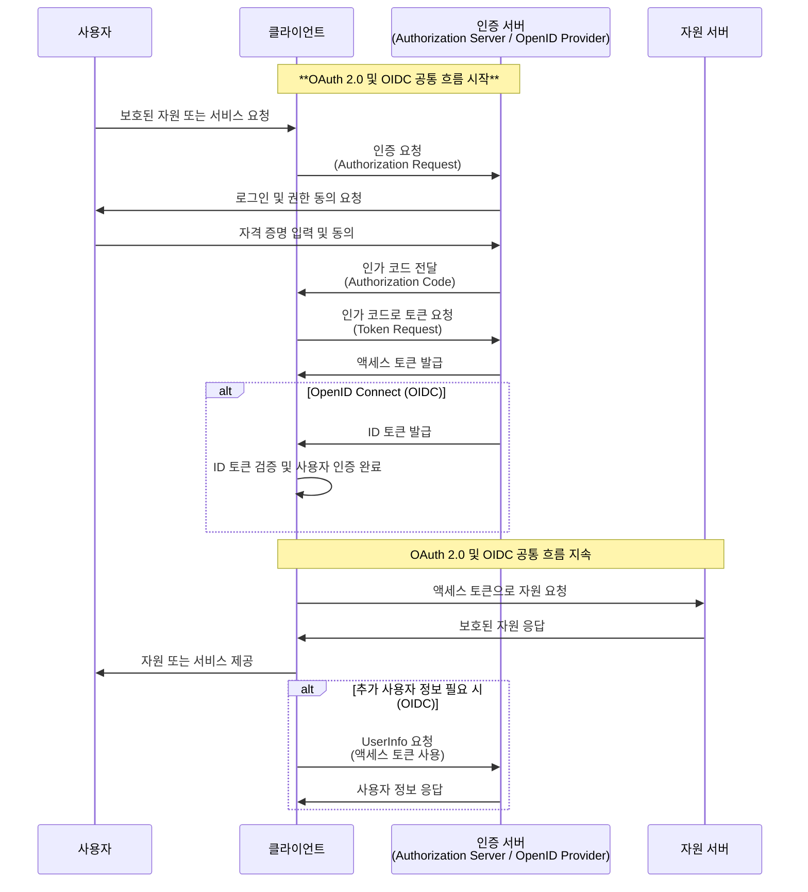
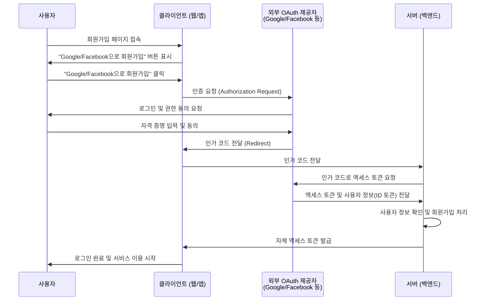
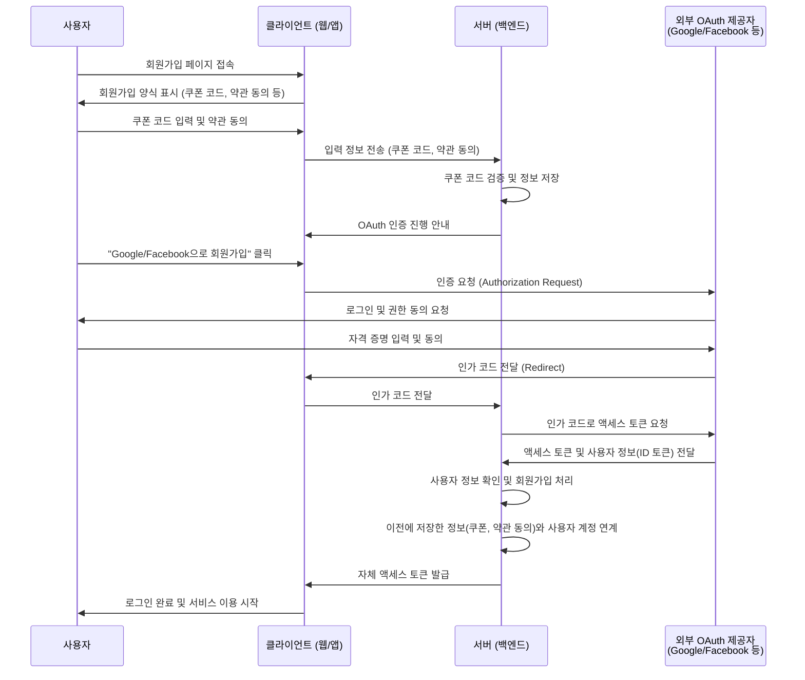

---
layout: default
headerEnable: true
headerTitle: 인증과 인가 이해하기
---

# OAuth란?

* OAuth라고 말하면 보통 OAuth 2.0을 의미
*	OAuth(Open Authorization)는 타사 애플리케이션이 사용자 비밀번호를 알지 않고도 사용자의 승인하에 보호된 자원에 접근할 수 있도록 해주는 인증 및 인가 프레임워크
  * 말이 조금 어려운데 한 마디로 말하면, 사용자의 동의를 받아 다른 애플리케이션에서 사용자의 정보를 사용할 수 있도록 하는 것
  * OIDC 기반으로 사용자의 신원을 확인할 수 있음
  * 보통 인증/인가 둘다 OAuth로 부르는 경우가 많음
  * 그렇지만 OAuth 2.0은 인가 프로토콜이고, OIDC는 인증 프로토콜

---
layout: default
headerEnable: true
headerTitle: 인증과 인가 이해하기
---

# OpenID Connect (OIDC)란?

* OAuth 2.0 프로토콜을 기반으로 구축된 **인증(Authentication)** 프로토콜
* OAuth 2.0의 **인가(Authorization)** 기능에 **인증** 기능을 추가하여, 사용자의 신원 확인을 가능하게 함

---
layout: default
headerEnable: true
headerTitle: 인증과 인가 이해하기
---

# 인증 / 인가 흐름

---
layout: default
headerEnable: true
headerTitle: 인증과 인가 이해하기
---

# 사례 / 외부 OAuth 제공자와 연동하여 회원가입하기

---
layout: default
headerEnable: true
headerTitle: 인증과 인가 이해하기
---

# 사례 / 데이터 저장을 위한 Prepare 단계가 있는 경우

